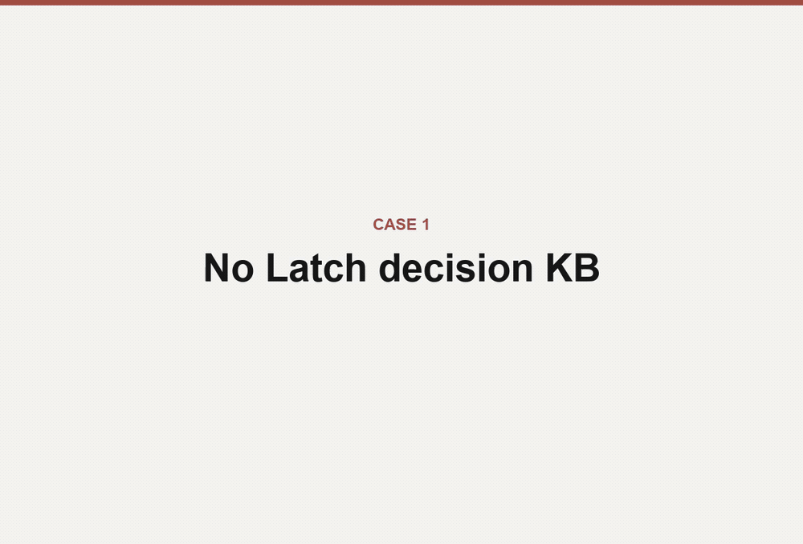

<p align="center">
  
</p>

<p align="center">
  <strong>You're paying for the same decisions over and over: every fresh agent session re-litigates settled calls and rebuilds paths you already rejected.</strong>
</p>

<p align="center">
  <em>latch makes your project's judgment compound &mdash; ratified decisions, rejected paths, and rationale carried into every run, and checked before an agent writes.</em>
</p>

<p align="center">
  Run more agents with less babysitting, and keep the codebase coherent while you do.
  Local-first &middot; reversible &middot; cited.
</p>

<p align="center">
  
</p>

<p align="center">
  <sub><b>Case 1 — same agent, same request, no decision captured:</b> it rebuilds the change the project had ruled out.</sub>
</p>
<p align="center">
  <sub><b>Case 2 — same prompt, decision in latch:</b> the gate cites the ruling and stops to let you decide, before a single file changes.</sub>
</p>

<p align="center">
  <a href="#the-receipt">The receipt</a> &middot;
  <a href="#why-a-gate-not-a-rule">Why a gate</a> &middot;
  <a href="#what-you-get-on-day-one">Day one</a> &middot;
  <a href="#get-started">Get started</a> &middot;
  <a href="#try-it-in-2-minutes">2-minute demo</a> &middot;
  <a href="#supported-agents">Agents</a> &middot;
  <a href="#safety-and-control">Overhead &amp; safety</a>
</p>

---

**The payoff isn't only fewer mistakes — it's speed.** Because the agent stays inside decisions
you've already made instead of re-opening a settled call, you re-catch less and can hand it more:
run several agents in parallel without babysitting each one to check it isn't rebuilding a path you
ruled out three sessions ago. That's the part cheaper-context and history-search tools don't give
you — not better recall, but earned confidence that the agent is working inside your judgment.

You can still override any verdict; reviving a rejected path just becomes a visible, cited decision
instead of silent drift. The judgment stays yours; latch just keeps the agent inside it.

New here? [Try the gate in ~2 minutes](#try-it-in-2-minutes) without touching your data — or
[seed it from your own sessions](#get-started) and watch it catch a decision you actually made.

## The receipt

**A fresh agent proposes a path this project already rejected:**

```text
Request: Add multi-user accounts by moving the datastore from local SQLite to a hosted Postgres service.
```

**latch's gate fires before any edit — and returns the receipt:**

```text
Recommendation: DO_NOT_PROCEED
Summary: The request directly repeats the rejected path in the KB: moving the local SQLite datastore to a hosted/client-server database such as managed Postgres to add multi-user accounts or sync (id=1). The canonical decision is to keep the demo app local-first on a single embedded SQLite file, with export/import as the allowed data-movement path.
Risk if proceed: It would violate the explicit local-first SQLite constraint and reopen a path already rejected for this demo app.
Better next action: Keep SQLite and implement any cross-machine data movement as an explicit export/import flow with documented limits.
Cited evidence:
- id=1 decision status=canonical: Keep the demo app local-first on SQLite — no hosted database
Worktree changed before/after gate: no
```

Read it field by field:

| Field | What it is |
| --- | --- |
| `Recommendation` | The go/no-go verdict: `DO_NOT_PROCEED`. |
| `Summary` | The settled decision and exactly why the request conflicts with it. |
| `Risk if proceed` | What breaks if the agent ignores the decision. |
| `Better next action` | The compliant alternative to take instead. |
| `Cited evidence` | The exact source node: `id=1`, kind `decision`, `status=canonical`. |
| `Worktree changed` | `no`. The gate ran **before** edits. Nothing on disk moved. |

That last line is the point. The rejected path was caught and cited, and your tree is untouched.

This exact receipt is checked in at [`proof/README.md`](./proof/README.md), captured with the
`codex` backend. It comes from a synthetic no-history demo, so it proves the gate path — not that
latch read anyone's real history. Seeding your own sessions is what does that.

## Why a gate, not a rule

Give an agent your history and it becomes better-informed, not bound: a bigger transcript is still
just context it can talk past. Give it a spec, a rule, or a `CLAUDE.md` and you hand it authority it
can ignore — or quote in one breath and violate in the same diff.

latch is the runtime gate that closes that gap. It keeps your project's cited decisions, rejected
paths, rationale, and evidence in a local KB, then puts a go/no-go verdict in the agent's path
**before files change** — and shows you the receipt. That is decision continuity, not a bigger
transcript or a generic recall layer.

It runs locally on SQLite, needs no cloud account, and targets macOS, Windows, and Linux. Claude
Code, Codex, and Cursor share the KB selected for the current project, so judgment captured through
one agent can gate another.

How the check reaches the agent is host-dependent, and latch is honest about it: on hosts with
lifecycle hooks (Claude Code, and Cursor with hooks enabled) the gate runs before edits as part of
the loop; on hosts without them the managed contract asks the agent to run it, and every receipt
records whether the gate actually ran.

**Where latch sits next to tools you already use.** Different layer, not a bigger prompt:

| Tool | What it's for | How its authority works |
| --- | --- | --- |
| Instruction / memory files (`CLAUDE.md`, `AGENTS.md`, Cursor rules) | Standing guidance for the agent | Prompt-enforced — the agent can ignore it, rewrite it, or quote it while violating it |
| Transcript / session search | Recover what was said or done before | Passive — surfaces the past only when a human thinks to look; checks nothing before an edit |
| Issue / task trackers | Coordinate what to work on | Organizational — track the work; they don't gate how it gets implemented |
| Spec / constitution frameworks (e.g. spec-kit) | Declare project rules and gates up front | Prompt-enforced — a "must pass" gate is markdown the agent reads, with no runtime check |
| **latch** | Check the next action against decisions you've already ratified | Runtime-checked — a go/no-go verdict with a cited receipt, before files change |

*Why not just a spec-kit extension?* An extension of a prompt-based framework inherits the same
failure class — the rule still reaches the agent as text it can talk past. latch runs the check as
code at the action boundary, so it complements those tools rather than competing with them.

And the check is cheap: the per-prompt retrieval hook runs locally in roughly 120–150 ms, and the
gate itself is a model call that fires only on write-shaped work — never on every prompt. Numbers
and repro scripts are in [Safety and control](#safety-and-control).

## What you get on day one

Install the runtime once, confirm the project it protects, and seed it. From the
next session on:

- **Every decision on file is one you ratified.** Seeding is review-first — `--apply` writes only the
  candidates you approve, so nothing is kept that you didn't sign off on.
- **The gate runs on coding-shaped work** and returns a go/no-go verdict citing the exact decision it
  relied on, before any file changes. On Claude Code and hook-enabled Cursor it runs as part of the
  loop; on hosts without lifecycle hooks the contract asks the agent to run it, and every receipt
  records whether it actually did.
- **You get a receipt, not an assurance.** latch shows a short foreground receipt when it shapes an
  answer or a gate fires, and `/latch-gate-report` audits recent gate activity without writing.
- **Shared across your agents, separate across client scopes when you opt in.** Every install —
  fresh or upgraded — keeps one global KB shared by all projects. Consultants can make the one-way
  `latch --enable-project-scopes` choice; from then on an unscoped location is LOCKED until you
  choose Shared (the existing global KB) or Private (a clean separate KB), and descendants inherit
  the nearest scope. No automatic lookup, copy, or import crosses KBs.
- **Your session start stays quiet.** A healthy session start injects no standing project brief — at
  most five compact pointers, when they're relevant.
- **Today's judgment carries into tomorrow, when you ask for it.** `/latch-compact` at a stopping
  point is user-initiated by design — it spends a model call — and writes the session's decisions
  down, so the next session inherits them instead of re-deriving them.

What day one does *not* give you is a catch you didn't seed: the gate is only as good as the
decisions you've ratified, and the honest limits are in
[Where the gate doesn't help](#where-the-gate-doesnt-help).

## Get started

**Prerequisites:** Git, and at least one installed agent CLI — **Claude Code**, **Codex**, or
**Cursor Agent**.

**Install in one command.** In an interactive terminal, the installer offers the current directory
as the project to protect; press Enter to accept it or enter another directory before anything is
wired.

macOS, Linux, or Windows Git Bash:

```bash
curl --proto '=https' --tlsv1.2 -LsSf https://raw.githubusercontent.com/open-latch/latch/main/install.sh | bash
```

Windows PowerShell:

```powershell
irm https://raw.githubusercontent.com/open-latch/latch/main/install.ps1 | iex
```

That's the install. The quickstart wires your agent, keeps the default global
shared KB (per-client project scopes are a separate, explicit one-way opt-in),
and offers seed only after the project is LATCHED.
**Restart the agent** afterward so its tools and hooks load.

**Then seed — this is the real first step, not an optional demo.** From here latch captures decisions
as you work; seeding is how you skip the wait. It backfills what your project already settled, so the
gate has something of *yours* to cite today rather than in three weeks. Point it at your recent
sessions:

```bash
/path/to/latch/bin/latch_seed.sh --source both --last-sessions 20 --apply
# Windows: C:\path\to\latch\bin\latch_seed.ps1 --source both --last-sessions 20 --apply

# Opt in to this project's local Cursor IDE history:
/path/to/latch/bin/latch_seed.sh --source cursor --cursor-history --last-sessions 20 --apply
```

It is review-first — the pass prints a structured report and writes only the candidates you approve
(enter `none` at the prompt to dismiss the whole report without writing anything). It recovers what
your transcripts actually contain, not everything you have ever decided; whatever it misses gets
captured as you work.
`--cursor-history` is opt-in and never implicit: it reads only IDE conversations assigned to this
project, excludes CLI sessions, cloud chats, and subagents, and fails closed if Cursor's metadata is
missing. The full walkthrough, source options, and review flags are in
[See it catch](#see-it-catch-seed-then-gate) and the
[first-run mission](./docs/first_run_mission.md); to read the installer first, pin a release, or
install to a custom directory, see [Install details](#install-details).

### Try it in 2 minutes

No history you want to point latch at yet — or want proof before seeding? Run the public-safe
fixture in a throwaway repo. It exercises the full gate path without reading any of your data:

```bash
/path/to/latch/bin/latch_demo_no_history.sh
# Windows: C:\path\to\latch\bin\latch_demo_no_history.ps1
```

The fixture is synthetic — it proves the gate fires, not that latch understood your history.
Seeding your own sessions is what makes the catches yours.

## See it catch: seed, then gate

The fixture proves the mechanism. The value is catching a decision from *your* history that your
next agent would plausibly revive.

**1. Seed your history** (you did this in [Get started](#get-started) — here are the source
options). Use `--source claude`, `codex`, `cursor`, `both`, or `all`; `--apply` is review-first and
writes only the candidates you approve, while omitting it previews only. From a hooked Cursor
conversation, `/latch-seed` is the normal path; Cursor uses only that exact hook-provided transcript
and never scans history. For an explicit project-history backfill, run the shell
seed command with `--cursor-history`; the normal bounded source and staging
review still apply.

**2. Pick one strong proof target** the seed surfaced:

- a concrete rejected approach or governing rule,
- the reason or allowed alternative,
- source and current status evidence,
- enough specificity that another agent could plausibly violate it.

**3. Ask an agent to implement that rejected approach.** Expect a foreground **Latch gate** receipt
before edits, cited against your own decision. A `SKIPPED`, `recommendation: null`, empty-evidence,
or `PROCEED` result on a plainly violating request **is not the proof.**

**Prove no edits with your own eyes.** Capture `git status` before and after a real gate call:

```bash
git status --short > /tmp/latch-proof.before
/path/to/latch/bin/run_latch_gate.sh '<generated request>' | tee /tmp/latch-gate-proof.json
git status --short > /tmp/latch-proof.after
diff -u /tmp/latch-proof.before /tmp/latch-proof.after
```

The diff should be empty — the gate ran, and no files moved.

**No history to seed yet?** Run the [2-minute fixture](#try-it-in-2-minutes) from Get started — it
proves the gate path without touching your data. The
[first-run mission](./docs/first_run_mission.md) and the
[proof-ready demo runbook](./runbooks/hook_proof_demo.md) carry the exact paths, success criteria,
and receipt checks.

## Supported agents

The guided quickstart wires whichever you choose.

| Agent | What latch installs | Boundary |
| --- | --- | --- |
| Claude Code | MCP tools, hooks, slash commands, `/latch-compact`, managed `CLAUDE.md` contract | Restart after install so tools and hooks load |
| Codex | Shared MCP tools + selected project KB, user skills, `AGENTS.md`, silent startup hook, Codex backend defaults | Start a new task after install; compaction is manual |
| Cursor | Project MCP, Rule, commands, skills, `AGENTS.md`; optional session/gate/activity hooks | Current-session seed/compact; opt-in project-local IDE history backfill |
| Multiple agents | The KB selected for the current project | A decision captured through one agent can gate the others in that project |

Cursor also needs three user-controlled live steps: authenticate with `agent login`, approve the
project MCP server, and enable **latch** in **Cursor Settings > Tools & MCP**. Static doctor success
alone does not prove the IDE gate is live. Per-surface manual install and doctor commands live in
[ARCHITECTURE.md](./ARCHITECTURE.md); see the [Cursor reference](./runbooks/cursor.md) and
[Cursor gate smoke](./runbooks/cursor_gate_smoke.md).

## Using latch day to day

You mostly do not operate latch. Once wired, the agent reads the KB before answering, captures
durable decisions as they happen, and runs `latch_gate` before coding-shaped changes — showing a
short foreground receipt when latch shapes an answer or a gate fires. Audit recent gate activity
without writing anything via `/latch-gate-report` or `bin/latch_gate_report.sh`.

At natural stopping points, capture the session so tomorrow's agent inherits today's judgment.
Compaction is user-initiated because it spends a model call and writes a durable summary into the KB:

- Claude Code: `/latch-compact`
- Codex: run the installed `latch-compact` skill (Codex has no top-level `/latch-*` command)
- Cursor: `/latch-compact` from the current hooked conversation

Or, you can simply ask latch in natural language, and the agent will offer the matching command.

## Using latch in more than one repo

You install the Latch runtime once. For **Claude Code** and **Codex**, its tools
and hooks are registered per-user. By default, Latch remains in **Global
Shared** mode: every repo uses the existing installed KB exactly as before.
Installing or upgrading does not create project boundaries or change routing.

Consulting mode is a deliberate, one-way opt-in. From the first root you want
to scope, choose:

- **Shared** — use the existing global KB;
- **Private** — create or select a separate KB.

and explicitly enable project scopes:

```bash
bash bin/latch.sh --confirm latch --enable-project-scopes --shared
# PowerShell: .\bin\latch.ps1 -Confirm latch -EnableProjectScopes -Shared
```

This drains active global-KB access, makes the current root explicitly Shared,
and makes every other unscoped location LOCKED. Use `--private --new-kb`
instead for a clean first client vault. It does not copy, delete, or repin KB
content. Once enabled, ordinary installer reruns preserve project mode and
cannot reopen ambient global access.

That choice applies to descendants unless a nearer root creates its own Private
scope or is explicitly unlatched. Private knowledge never appears in the global
KB, and the global KB never reads a Private KB. Run the quickstart from another
repo when it also needs the managed `CLAUDE.md` / `AGENTS.md` contract. Cursor
wiring remains per-repo.

## Safety and control

**Local-first.** latch stores project judgment locally in SQLite and requires no cloud account. It
never uploads your KB. Data leaves your machine only when you run a model-backed path — the gate,
compaction, or the nightly heal pass — which may send selected prompts, snippets, and evidence to the
Claude, Codex, or Cursor backend *you* configured.

**Overhead.** The per-prompt retrieval hook runs locally against the KB —
roughly 120–150 ms on an Apple Silicon reference machine, inside a 250 ms
budget — and injects at most five compact KB pointers. A healthy session start
injects no standing project brief. Freshening a plan uses a surgical append
(~34 tokens) rather than a full-body rewrite (~9,900 tokens). The gate itself
is a model call, so it runs only on write-shaped changes, not on every prompt.
Reproduce with `tests/measure_hook_latency.py` and
`tests/measure_write_path.py`.

**What it costs.** latch has no account or API key of its own — model-backed steps run through the
Claude, Codex, or Cursor CLI you already use, drawing on your existing subscription rather than a
separate bill. The frequent work stays local and free: search, retrieval, the per-prompt hook, and
assembling the decisions a gate cites all run against SQLite and a small on-device embedding model.
Only discrete judgment steps spend a call — the gate (on write-shaped changes), compaction (when you
ask), and a nightly background *heal* that reconciles contradictions. Per-day caps bound the
background work (defaults: 100 foreground calls, 33 nightly heal), so a fresh install can't run up a
surprise; `bin/latch_gate_report.sh` shows recent activity without spending anything.

**Kill switch.** Stop latch hooks without uninstalling:

```bash
bash bin/latch_disable.sh
bash bin/latch_enable.sh
bash bin/latch_status.sh
```

**Latch and unlatch.** In Global Shared mode, `unlatch` keeps its existing
install-wide meaning: every repo is off until `latch` restores the installation.
In consulting mode, both commands operate on one filesystem scope. Scope authority is machine-local and
does not depend on Git. To keep native agent instructions consistent while Latch is off, `/unlatch`
also temporarily masks Latch-managed regions in `CLAUDE.md` / `AGENTS.md`; those working-tree edits may
be visible to Git and should not be committed. `/latch` restores them, including an exact
Latch-owned override found without local state. Descendants and authorized root aliases of one
scope follow its mode, but project-mode commands never change another scope or the existing
install-level KB pin. Status is read-only; changing state requires the exact confirmation word:

```bash
bash bin/unlatch.sh
bash bin/unlatch.sh --confirm unlatch
bash bin/latch.sh --confirm latch
```

Re-latching an UNLATCHED scope with no KB option preserves its previous binding.
In consulting mode, a LOCKED root must choose Shared or Private:

```bash
# This repo keeps using the existing installation KB.
bash bin/latch.sh --confirm latch --shared

# This client repo gets a fresh external KB with no knowledge data.
bash bin/latch.sh --confirm latch --private --new-kb

# Or bind only this repo to an existing absolute KB directory.
bash bin/latch.sh --confirm latch --private --kb-dir "/absolute/path/to/client-kb"
```

Every `--new-kb` call creates a new directory containing only Latch routing/continuity metadata;
it does not create `kb.db` or seed, copy, or port anything from the primary KB. Start a fresh
agent task in that repo (do not resume the old one) after changing its mode or binding. A legacy
`LATCH_UNLATCHED` environment variable or old install-wide sentinel is reported as global and must
be cleared before project-local mode can be trusted.

This is a **project KB boundary**, not a complete NDA clean room. Agent/provider histories,
opt-in external debug output, and operating-system temporary artifacts can exist outside the
selected KB. Cursor chats in the same repo also share that repo's KB; Cursor does not currently
provide Latch a per-conversation MCP identity. Start a fresh chat after a mode or KB change, and do
not use project KB selection as the only boundary for regulated or client-confidential work.

**Uninstall.** Preview or remove latch wiring. Production KB data and protected
backups are always retained. `--purge` removes only kill-switch files; it has no
KB deletion path:

```bash
bash bin/uninstall.sh --dry-run
bash bin/uninstall.sh

# Remove only latch-owned Cursor wiring from the current project:
bash bin/uninstall.sh --yes --cursor-only --cursor-project "$PWD"
```

## When a decision changes

A decision isn't frozen forever, and the gate cites which state it's in:

- **current** — the ruling still stands, so the gate holds the agent to it.
- **rejected** — the specific path that was ruled out, carried with its reason.
- **superseded** — a newer decision replaced it; the old one stops gating and the receipt points to
  what replaced it.
- **reconciled** — a newer decision narrowed it without fully replacing it; both stay in scope.

Because the receipt names the status, a stale ruling is visible rather than silently binding — and
overriding one is a single recorded decision, which itself becomes the trigger to supersede the old
one. That is how a ratified decision avoids outliving its rationale.

## Where the gate doesn't help

An honest guardrail names its limits.

- **It warns and cites; it doesn't handcuff.** The gate recommends — you can still choose to proceed.
  latch stops silent drift, not deliberate decisions.
- **An empty KB catches nothing.** With no captured judgment there is nothing to gate. Seed first.
- **A lost reason is reconstructed, not invented.** When the original rationale isn't recoverable,
  the agent presents a reconstruction for your confirmation rather than asserting it as fact.
- **The fixtures are instruments, not scorecards.** The bundled evals prove the gate path on small
  suites; they are not broad claims about every repo or model.

## Proof and limits

The checked-in [V1 public proof packet](./proof/README.md) pairs one observed model-backed receipt
with two small deterministic fixture suites:

| Evidence | Result | Meaning |
| --- | ---: | --- |
| Live pre-edit gate | `DO_NOT_PROCEED` | Cited a canonical rejected path; worktree unchanged |
| Decision-evidence fixture | `latch_evidence` 8/8; `memory_like` 4/8 | Small internal ablation, not a third-party benchmark |
| Seed-report fixture | 16/16 | Deterministic capture/filtering checks; zero model calls |

Regenerate them:

```bash
bash bin/latch_eval.sh
bash bin/latch_seed_report_eval.sh
bash bin/latch_proof_packet.sh --check
```

Read the `memory_like` row as an internal active-search-only ablation, not a benchmark of any
third-party product. The `latch_evidence` label is a gate-evidence benchmark capability, not a
user-facing setting; don't read it as a retrieval-policy comparison or a rebuild-savings claim.
Details in [benchmarks/README.md](./benchmarks/README.md).

## Install details

**What the installer does.** The bootstrap preserves your project path and installs a private,
isolated [`uv`](https://docs.astral.sh/uv/) + Python 3.11 runtime — it does not touch your shell
profile or require a system Python. It asks which agent surfaces to wire, runs
their doctor checks, and offers a bounded initial-KB review only after the
selected project is LATCHED. On a default install that means the global shared
KB; only a machine that has opted into project scopes has LOCKED locations, and
a LOCKED project instead gets the exact Shared and Private `latch` commands.
Selected transcripts are listed and redacted before
any model call, and nothing is written until you approve it. Rerunning the
command repairs and reconciles the existing install
while keeping its current Latch source revision; it never silently switches to
a newer release or commit. One installation serves many repos; `--install-dir
PATH` (PowerShell `-InstallDir PATH`) picks an alternate location. Install
internals and per-surface manual setup live in
[ARCHITECTURE.md](./ARCHITECTURE.md).

To stay current, periodically check for a newer tagged release using the explicit update commands in
[Versions and platform](#versions-and-platform).

**Pass quickstart options** through the piped Bash form after `bash -s --`:

```bash
curl --proto '=https' --tlsv1.2 -LsSf https://raw.githubusercontent.com/open-latch/latch/main/install.sh | bash -s -- --agents both
```

**Inspect or pin before you run.** To inspect either installer first, download the script and read it
locally. The piped command follows `main`; for a stable build, pin both the script and the checkout
ref to the latest tagged release (currently `v1.0.0`) so the install cannot drift back to `main`:

```bash
curl --proto '=https' --tlsv1.2 -LsSf https://raw.githubusercontent.com/open-latch/latch/v1.0.0/install.sh | LATCH_INSTALL_REF=v1.0.0 bash
```

```powershell
& ([scriptblock]::Create((irm https://raw.githubusercontent.com/open-latch/latch/v1.0.0/install.ps1))) -Ref v1.0.0
```

### Automatic retrieval and catch-up

Latch uses one automatic retrieval policy. On hosts with a prompt hook, each
eligible prompt gets bounded local similarity retrieval, including same-topic
follow-ups, with visible hit, no-hit, and degraded-runtime receipts. Those
pointers are teasers; the managed agent contract still requires the agent to
fetch authoritative nodes before relying on them.

Healthy session starts inject no standing project brief. When the user asks
“where were we?”, “catch me up”, or “what should I pick up next?”, the agent
combines the bounded project-direction report with three recent progress rows,
then drills into the foreground node.
Codex and Cursor do not currently expose the similarity prompt hook, so their
automatic contract-driven reads and gates remain the active retrieval surface.
Use the advanced disable or unlatch controls when you genuinely need to turn
Latch off.

## Versions and platform

Stable builds use immutable `vX.Y.Z` Git tags and matching Releases; `main` is development code, not
the update channel. Check and apply updates explicitly:

```bash
bash bin/latch_version.sh          # Windows: .\bin\latch_version.ps1
bash bin/latch_update.sh --check
bash bin/latch_update.sh --dry-run
bash bin/latch_update.sh --yes
```

The updater operates only on a clean official `open-latch/latch` clone, backs up every discovered KB
before a schema upgrade, and refuses to open a KB written by a newer schema.

Already-wired projects carry a small wiring version in their latch-owned marker.
On the next SessionStart, the agent performs a local marker-only comparison:
current wiring is silent and write-free, older managed wiring is repaired once
with a receipt and backup, and newer wiring is never downgraded. Unmanaged repos
remain untouched. Cursor without hooks performs the same check when its existing
project MCP server starts. Restart the relevant agent when a receipt says hooks
or MCP configuration changed.

Release tags are forward updates. Pre-migration snapshots are written to the
external durability root with hashes, integrity receipts, and a thirty-day
protection deadline; they are never stored beside the live KB.

## Platform Notes

- **Python >= 3.11**, native-architecture. Python 3.12 and 3.13 also work.
- **uv** is the recommended venv/dependency installer. In Git Bash on Windows,
  activate the venv with `source .venv/Scripts/activate`.
- A working `python` must be on `PATH`, or set `LATCH_PYTHON` to its absolute
  path (`CLAUDE_KB_PYTHON` remains a legacy alias).

### Apple Silicon Arm64

Use a native arm64 Python. A venv built with an Intel Python under Rosetta
installs x86_64 wheels, and sqlite-vec's prebuilt x86_64 binary can crash at
extension-load time. Verify with:

```bash
python3 -c "import platform; print(platform.machine())"
```

It should print `arm64`; the doctor detects the mismatch and prints the remedy.

## License and public boundary

Source in this repository is licensed under the Apache License, Version 2.0. See
[LICENSE](./LICENSE), [LICENSING.txt](./LICENSING.txt), and [NOTICE](./NOTICE).

This public repo is the local single-player decision-continuity core: install, doctor, seed/report,
local KB, `latch_gate`, receipts, evals, and Claude Code / Codex / Cursor adapter wiring —
inspectable, forkable, and useful without a cloud account. The latch name and branding are not
licensed under Apache 2.0; see [TRADEMARK.md](./TRADEMARK.md) and [CONTRIBUTING.md](./CONTRIBUTING.md).

## Documentation

| Start here | Go deeper |
| --- | --- |
| [First-run mission](./docs/first_run_mission.md) | [Proof-ready demo](./runbooks/hook_proof_demo.md) |
| [Public proof packet](./proof/README.md) | [Benchmarks](./benchmarks/README.md) |
| [Cursor reference](./runbooks/cursor.md) | [Cursor gate smoke](./runbooks/cursor_gate_smoke.md) |
| [Architecture](./ARCHITECTURE.md) | [Shared MCP runtime](./docs/mcp_resource_architecture.md) |

Install internals, per-surface manual install, and maintenance machinery live in
[ARCHITECTURE.md](./ARCHITECTURE.md). This README stays focused on the local decision-continuity
workflow.
